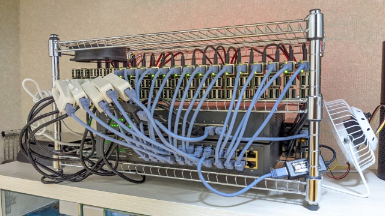
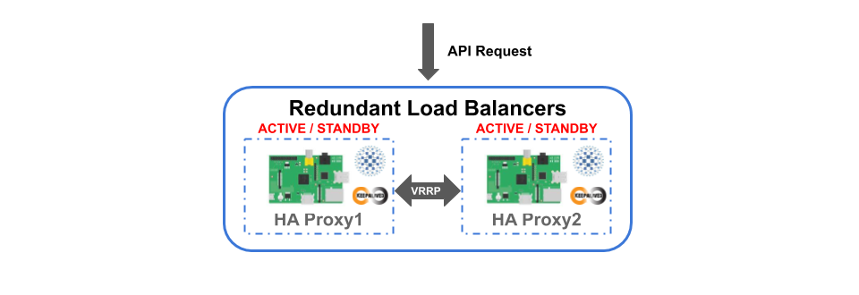
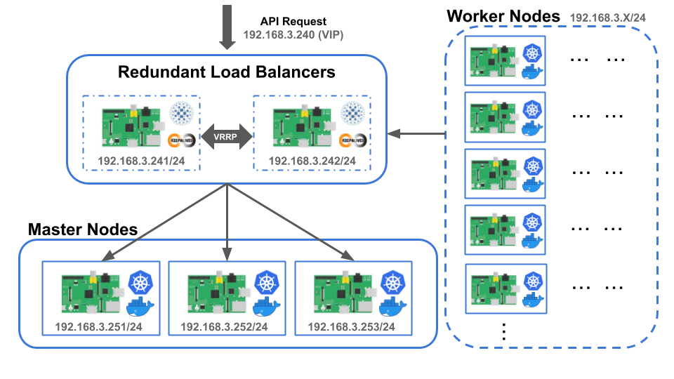
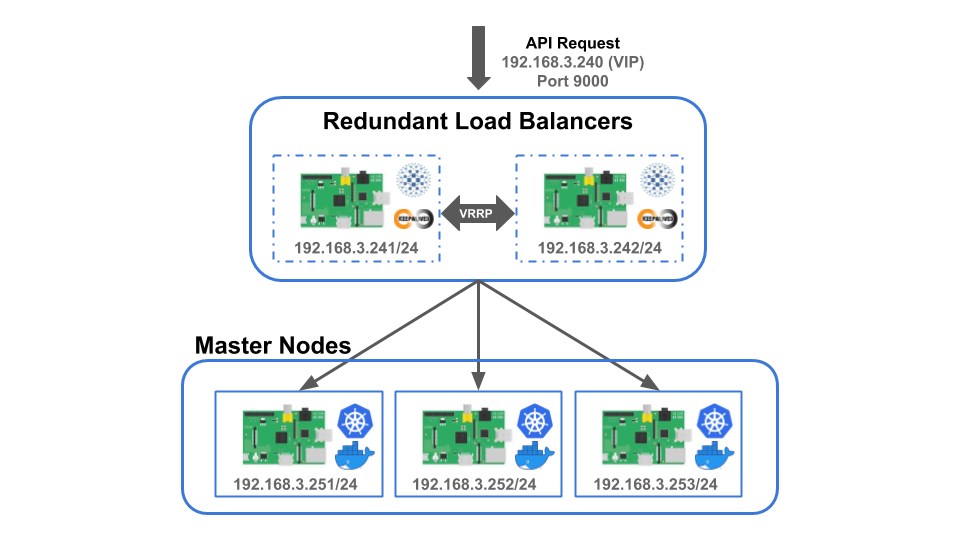

# 高可用性ラズパイKubernetesクラスターの構築

## 概要
このリポジトリはRaspberry Piで高可用性Kubernetesクラスターを構築するための手順とビルドスクリプトをまとめたものです。  




## アーキテクチャー
高可用性ラズパイKubernetesクラスターのアーキテクチャーを下記に示します。  
本アーキテクチャーは大きく **3つのコンポーネント** で構成されています。  
アクティブ/アクティブ構成で冗長化された **アクティブ/アクティブ冗長化構成Kubernetesマスターノード群** と **Kubernetesワーカーノード群** で構築されたクラスター、そのクラスターのkube-apiserverに対するAPIリクエストを複数のマスターノードに分散させるためのアクティブ/スタンバイ構成で冗長化された **アクティブ/スタンバイ冗長化構成ロードバランサ** です。  

<br>


## Kubernetesワーカーノード群
Kubernetesワーカーノード群はKubernetesマスターノード群によってスケジューリングされたPodを動作させます。  

アクティブ/アクティブ冗長化構成Kubernetesマスターノード群の構築、アクティブ/スタンバイ冗長化構成ロードバランサの構築が完了したらワーカーノードをクラスターに参加させ、ワーカーノード群を形成します。  

Kubernetesワーカーノード群の構築に関しましては高可用性Kubernetesクラスターの構築に直接的に関与しないため、ワーカーノードをクラスターに参加させる方法、クラスターの動作検証の方法などについては言及しません。  
ワーカノードをクラスターに参加させる方法に関しましては[ワーカーノードの設定](https://github.com/izewfktvy533zjmn/Build_RasPi_Kubernetes_Cluster/blob/master/README.md#%E3%83%AF%E3%83%BC%E3%82%AB%E3%83%BC%E3%83%8E%E3%83%BC%E3%83%89%E3%81%AE%E8%A8%AD%E5%AE%9A)をクラスターの動作検証の方法に関しましては[Kubernetesクラスターの動作検証方法](https://github.com/izewfktvy533zjmn/Build_RasPi_Kubernetes_Cluster/blob/master/README.md#kubernetes%E3%82%AF%E3%83%A9%E3%82%B9%E3%82%BF%E3%83%BC%E3%81%AE%E5%8B%95%E4%BD%9C%E6%A4%9C%E8%A8%BC%E6%96%B9%E6%B3%95)を参考にして下さい。  


## アクティブ/アクティブ冗長化構成Kubernetesマスターノード群
Kubernetesマスターノードはクラスターの操作機能の提供(kube-apiserver)、クラスターに関する情報の管理(etcd)、PodのスケジューリングやPodを適切なワーカーノードに再割り当てるための管理(kube-scheduler)、ワーカーノードの状態監視(kube-controller-manager)といったKubernetesクラスター全体の管理を行います。  

シングルコントロールプレーンクラスターでは1台のマスターノードが故障した場合、クラスターの管理を継続させることができません。  
システムを構成する部分のうち、そこに障害が発生するとシステム全体が停止してしまう部分を **単一障害点 (SPOF : Single Point of Failure)** と呼びますが、シングルコントロールプレーンクラスターではこの1台のマスターノードが単一障害点となります。  
そこで、コントロールプレーンを複数用意することでマスターノードに対して冗長化構成をとり、あるマスターノードが故障した場合でも他のマスターノードがクラスターの管理を継続することを可能にすることで単一障害点をなくし、高可用性クラスターを実現させることができます。  

本アーキテクチャーでのKubernetesマスターノード群は **アクティブ/アクティブ構成** を採ることで冗長化させます。  
アクティブ/アクティブ構成とは、同じ機能を持つシステムコンポーネントを複数用意し、これらのコンポーネントを常に同時に稼動させるようなシステム構成をとる冗長化手法の一つです。  
このような冗長化手法を採ることで、各コンポーネントに対する負荷分散がもたらすシステムパフォーマンスの向上や、あるコンポーネントが機能を継続することができなくなった場合でも他の同じ機能を持つコンポーネントが代わりに機能を提供することができるため、システムの可用性を高めることができます。  

<br>

Kubernetesマスターノード群に対してアクティブ/アクティブ構成をとる場合、下記の項目に関して対処する必要があります。

**1. クラスターに関する情報をマスターノード間で共有する必要がある**  
**2. クラスターの操作に関するAPIリクエストを各マスターノードのkube-apiserverに振り分ける必要がある**

本アーキテクチャーでは上記の項目に関する対処方法に対して、以下の方法を採っています。  

1.に関しては、マスターノード同士がetcdクラスター上に情報を保存することでKubernetesクラスターに関する情報を共有させます。  
etcdクラスターを構築する方法として、[Kubernetes公式ドキュメントに記載されている方法](https://kubernetes.io/ja/docs/setup/production-environment/tools/kubeadm/high-availability/)があります。  
本Kubernetesクラスターの構築にあたって、公式ドキュメントに記載されているetcdクラスターを構築する方法からetcdのメンバーとコントロールプレーンを結合した構成である積み重なったコントロールプレーンを使う方法を採用しています。  

2.に関しては、負荷分散によってAPIリクエストの振り分けを行うことができるためロードバランサを導入することで対処することが可能ですが、高可用性を実現させるためにはこの導入するロードバランサに対していくつかの制約があります。

- **マスターノードが正常に稼働しているか確認することができる監視機能がなければならない**
- **障害が発生したマスターノードに対しては処理を振り分けないようにしなければならない**
- **ロードバランサ自体が単一障害点とならないように冗長化しなければならない**

本アーキテクチャーでは、上記の制約を満たすために **アクティブ/スタンバイ冗長化構成ロードバランサ** を導入することで対処しています。


## アクティブ/スタンバイ冗長化構成ロードバランサ
**アクティブ/スタンバイ冗長化構成ロードバランサ** はアクティブ/アクティブ冗長化構成Kubernetesマスターノード群に対するクラスター操作のAPIリクエストを受け取り、各マスターノードのkube-apiserverにリクエストを振り分ける役割を担っています。  

本アーキテクチャーにおける高可用性を実現させるための制約を満たすために、負荷分散機能やHTTPリバースプロキシとしての機能、サーバに対するの監視機能、ヘルスチェック機能による非稼働中のサーバに対するリクエスト振り分けの停止などを提供するオープンソースのTCP/HTTPプロキシソフトウェアである[**HAProxy**](http://www.haproxy.org/)を利用することでロードバランサを構築します。  

また、本アーキテクチャーにおいて、高可用性を実現させるためには **"ロードバランサ自体が単一障害点とならないように冗長化しなければならない"** という制約がありました。  
冗長化手法に関しては、[アクティブ/アクティブ冗長化構成Kubernetesマスターノード群](#アクティブ/アクティブ冗長化構成Kubernetesマスターノード群)にで **アクティブ/アクティブ構成** という手法を説明しました。  
これに対して、導入するロードバランサでは **アクティブ/スタンバイ構成** という冗長化手法を採っています。  
アクティブ/スタンバイ構成とは、同じ機能を持つシステムコンポーネントを複数用意し、ある一つのコンポーネントだけを稼働状態とし、他のコンポーネントは待機状態にしておくようなシステム構成をとる冗長化手法の一つです。  
このような冗長化手法は、何らかの原因によって稼動状態のシステムコンポーネントに障害が発生したとき、待機状態のシステムコンポーネントを稼動状態へと切り替えることによってシステムの稼働を継続させることができるため、システムの可用性を高めることができます。

本アーキテクチャーでは、仮想IPアドレス(VIP)の引き継ぎ機能やVRRPによるサーバの死活監視機能、サービスのヘルスチェック機能などを提供するソフトウェアである[**Keepalived**](https://www.keepalived.org/)を利用することで **アクティブ/スタンバイ冗長化構成ロードバランサ** を構築します。

<br>


## ネットワーク構成
高可用性ラズパイKubernetesクラスターの構築例を示すにあたり、下記に示すネットワーク構成を想定しました。  

クラスターの操作に関するAPIリクエストを受け取るアクティブ/スタンバイ冗長化構成ロードバランサのIPアドレスとして仮想IPアドレスである **192.168.3.240/24** を割り当て、ポート番号9000番をリスニングポートとして利用することにします。  

アクティブ/スタンバイ冗長化構成ロードバランサのコンポーネントとして稼働する2台のロードバランサに対してはIPアドレスとして、 **192.168.3.241/24** と **192.168.3.242/24** を割り当て、また、リスニングポートに対する受信パケットの流入を許可するために9000番ポートを開放することにします。  

アクティブ/アクティブ冗長化構成Kubernetesマスターノード群のコンポーネントとして稼働する3台のマスターノードに対してはそれぞれ **192.168.3.251/24** と **192.168.3.252/24** 、**192.168.3.253/24** を割り当てることにします。  




## 要求
- マスターノード用Raspberry Pi：3台以上 (奇数台にする必要有り)
- ワーカーノード用Raspberry Pi：1台以上
- ロードバランサ用Raspberry Pi：2台以上
- Raspberry Piがクラスターとして稼働するための最低限の周辺機器で構成されており、初期設定済みであること
- 全てのRaspberry Piに対して、SSHでpiユーザにログインできること
- マスターノードは他の全てのマスターノードに対し、公開鍵認証でSSH接続できること
- kubeadmとkubelet、kubectlがマスターノードとワーカーノードにインストールされており、Kubernetesクラスターを構築する環境が整っていること

_**\* Raspberry Pi上にKubernetesクラスターを構築する環境を整える場合、[ラズパイKubernetesシングルコントロールプレーンクラスターの構築](https://github.com/izewfktvy533zjmn/Build_RasPi_Kubernetes_Cluster)を参考にすることを推奨します。**_


## 環境
### マスターノード
- Raspberry Pi 4 Model B
  - Docker v19.03.8
  - Kubernetes v1.13.5


### ワーカーノード
- Raspberry Pi 3 Model B
  - Docker v18.06.3
  - Kubernetes v1.13.5


- Raspberry Pi 4 Model B
  - Docker v19.03.8
  - Kubernetes v1.13.5


### ロードバランサ
- Raspberry Pi 4 Model B
  - Keepalived v2.0.10
  - HAProxy v1.8.19


## アクティブ/スタンバイ冗長化構成ロードバランサの構築
**アクティブ/スタンバイ冗長化構成ロードバランサ** の構築方法に関しましては、[**こちら**](https://github.com/izewfktvy533zjmn/Build_HA_RasPi_K8s_Cluster/tree/master/rlb)を参照して下さい。

<br>


## アクティブ/アクティブ冗長化構成Kubernetesマスターノード群の構築
現在、作成中です。(2020年4月13日)
ここでは、アクティブ/アクティブ冗長化構成Kubernetesマスターノード群の構築を行っていきます。  

<br>

まず始めに、**全てのマスターノード にて下記のコマンドを実行** することで、アクティブ/アクティブ冗長化構成Kubernetesマスターノード群構築用スクリプトをダウンロードし、スクリプトに実行権限を与えて下さい。  

```
cd $HOME
git clone https://github.com/izewfktvy533zjmn/Build_HA_RasPi_K8s_Cluster.git
cd Build_HA_RasPi_K8s_Cluster/scripts && chmod +x *
```


## iptablesにおけるnftablesバックエンドの使用停止
マスターノードにRaspbian Busterを用いたRaspberry Pi 4を使用している場合、iptablesはバックエンドにてnftablesを使用しています。  
現在のkubeadmではnftablesと互換性がないため、iptablesをレガシーモードに切り替える必要があります。  
[公式ドキュメント](https://kubernetes.io/ja/docs/setup/production-environment/tools/kubeadm/install-kubeadm/#iptables%E3%81%8Cnftables%E3%83%90%E3%83%83%E3%82%AF%E3%82%A8%E3%83%B3%E3%83%89%E3%82%92%E4%BD%BF%E7%94%A8%E3%81%97%E3%81%AA%E3%81%84%E3%82%88%E3%81%86%E3%81%AB%E3%81%99%E3%82%8B)に従って、**全てのマスターノード** にて設定を行って下さい。  


## kubeadm設定ファイルの作成
まず、いずれかのマスターノードに対して、**piユーザ** でログインします。  
ここでは、IPアドレスが192.168.3.251であるマスターノード(Master1)に対してSSH接続します。  

```
ssh pi@192.168.3.251
```

次に、**kubeadm init** 時に使用する **kubeadm-config.yaml** ファイルを **make_kubeadm-confg.sh** スクリプトを使用して作成していきます。  

```
./make_kubeadm-confg.sh
"Usage: ./make_kubeadm-confg.sh LOAD_BALANCER_IP_ADDRESS LOAD_BALANCER_PORT
```

スクリプトの引数として[アクティブ/スタンバイ冗長化構成ロードバランサの構築](#アクティブ/スタンバイ冗長化構成ロードバランサの構築)にて設定した仮想IPアドレスとリスニングポートを指定し、スクリプトを **piユーザ権限** 実行します。  

```
./make_kubeadm-confg.sh 192.168.3.240 9000
```

設定ファイルが作成されると下記のようなメッセージが現れます。  

```
make kubeadm-config.yaml done.
```

**Build_HA_RasPi_K8s_Cluster/manifests** フォルダ直下に、下記の内容の **kubeadm-config.yaml** ファイルが作成されていることを確認します。  

```
apiVersion: kubeadm.k8s.io/v1beta1
kind: ClusterConfiguration
kubernetesVersion: v1.13.5
apiServer:
  certSANs:
  - "192.168.3.240"
controlPlaneEndpoint: "192.168.3.240:9000"
networking:
  podSubnet: 10.244.0.0/16
```

_**\* なお、本クラスターではCNIプラグインとして、Flannelを使用するため、podSubnetには10.244.0.0/16を設定しています。**_


## クラスター構築の初期化
[kubeadm設定ファイルの作成](#kubeadm設定ファイルの作成)でログインしたマスターノード上にて、**init.sh** スクリプトを使用してクラスター構築の初期化を行っていきます。  

```
sudo ./init.sh
Usage: ./init.sh ANOTHER_CONTROL_PLANE_NODES_IP_ADDRESS...
```

スクリプトの引数として、アクティブ/アクティブ冗長化構成Kubernetesマスターノード群において **現在ログインしているマスターノード以外のIPアドレスを全て指定** し、このスクリプトを **sudo権限** で実行します。  

```
sudo ./init.sh 192.168.3.252 192.168.3.253
```

このスクリプトの動作過程において、下記のようなメッセージが現れます。  
なお、このスクリプトの終了には、**約2分** かかります。  


```
pi@makina-master1:~/Build_HA_RasPi_K8s_Cluster/scripts $ sudo ./init.sh 192.168.3.252 192.168.3.253
[preflight] running pre-flight checks
[reset] no etcd config found. Assuming external etcd
[reset] please manually reset etcd to prevent further issues
[reset] stopping the kubelet service
[reset] unmounting mounted directories in "/var/lib/kubelet"
[reset] deleting contents of stateful directories: [/var/lib/kubelet /etc/cni/net.d /var/lib/dockershim /var/run/kubernetes]
[reset] deleting contents of config directories: [/etc/kubernetes/manifests /etc/kubernetes/pki]
[reset] deleting files: [/etc/kubernetes/admin.conf /etc/kubernetes/kubelet.conf /etc/kubernetes/bootstrap-kubelet.conf /etc/kubernetes/controller-manager.conf /etc/kubernetes/scheduler.conf]

The reset process does not reset or clean up iptables rules or IPVS tables.
If you wish to reset iptables, you must do so manually.
For example:
iptables -F && iptables -t nat -F && iptables -t mangle -F && iptables -X

If your cluster was setup to utilize IPVS, run ipvsadm --clear (or similar)
to reset your system's IPVS tables.

[init] Using Kubernetes version: v1.13.5
[preflight] Running pre-flight checks
	[WARNING SystemVerification]: this Docker version is not on the list of validated versions: 19.03.8. Latest validated version: 18.06
[preflight] Pulling images required for setting up a Kubernetes cluster
[preflight] This might take a minute or two, depending on the speed of your internet connection
[preflight] You can also perform this action in beforehand using 'kubeadm config images pull'
[kubelet-start] Writing kubelet environment file with flags to file "/var/lib/kubelet/kubeadm-flags.env"
[kubelet-start] Writing kubelet configuration to file "/var/lib/kubelet/config.yaml"
[kubelet-start] Activating the kubelet service
[certs] Using certificateDir folder "/etc/kubernetes/pki"
[certs] Generating "front-proxy-ca" certificate and key
[certs] Generating "front-proxy-client" certificate and key
[certs] Generating "etcd/ca" certificate and key
[certs] Generating "etcd/healthcheck-client" certificate and key
[certs] Generating "apiserver-etcd-client" certificate and key
[certs] Generating "etcd/server" certificate and key
[certs] etcd/server serving cert is signed for DNS names [makina-master1 localhost] and IPs [192.168.3.251 127.0.0.1 ::1]
[certs] Generating "etcd/peer" certificate and key
[certs] etcd/peer serving cert is signed for DNS names [makina-master1 localhost] and IPs [192.168.3.251 127.0.0.1 ::1]
[certs] Generating "ca" certificate and key
[certs] Generating "apiserver-kubelet-client" certificate and key
[certs] Generating "apiserver" certificate and key
[certs] apiserver serving cert is signed for DNS names [makina-master1 kubernetes kubernetes.default kubernetes.default.svc kubernetes.default.svc.cluster.local] and IPs [10.96.0.1 192.168.3.251 192.168.3.240 192.168.3.240]
[certs] Generating "sa" key and public key
[kubeconfig] Using kubeconfig folder "/etc/kubernetes"
[endpoint] WARNING: port specified in controlPlaneEndpoint overrides bindPort in the controlplane address
[kubeconfig] Writing "admin.conf" kubeconfig file
[endpoint] WARNING: port specified in controlPlaneEndpoint overrides bindPort in the controlplane address
[kubeconfig] Writing "kubelet.conf" kubeconfig file
[endpoint] WARNING: port specified in controlPlaneEndpoint overrides bindPort in the controlplane address
[kubeconfig] Writing "controller-manager.conf" kubeconfig file
[endpoint] WARNING: port specified in controlPlaneEndpoint overrides bindPort in the controlplane address
[kubeconfig] Writing "scheduler.conf" kubeconfig file
[control-plane] Using manifest folder "/etc/kubernetes/manifests"
[control-plane] Creating static Pod manifest for "kube-apiserver"
[control-plane] Creating static Pod manifest for "kube-controller-manager"
[control-plane] Creating static Pod manifest for "kube-scheduler"
[etcd] Creating static Pod manifest for local etcd in "/etc/kubernetes/manifests"
[wait-control-plane] Waiting for the kubelet to boot up the control plane as static Pods from directory "/etc/kubernetes/manifests". This can take up to 4m0s
[kubelet-check] Initial timeout of 40s passed.
[apiclient] All control plane components are healthy after 100.106950 seconds
[uploadconfig] storing the configuration used in ConfigMap "kubeadm-config" in the "kube-system" Namespace
[kubelet] Creating a ConfigMap "kubelet-config-1.13" in namespace kube-system with the configuration for the kubelets in the cluster
[patchnode] Uploading the CRI Socket information "/var/run/dockershim.sock" to the Node API object "makina-master1" as an annotation
[mark-control-plane] Marking the node makina-master1 as control-plane by adding the label "node-role.kubernetes.io/master=''"
[mark-control-plane] Marking the node makina-master1 as control-plane by adding the taints [node-role.kubernetes.io/master:NoSchedule]
[bootstrap-token] Using token: c4xmd2.zjodd1afdkqfdu7x
[bootstrap-token] Configuring bootstrap tokens, cluster-info ConfigMap, RBAC Roles
[bootstraptoken] configured RBAC rules to allow Node Bootstrap tokens to post CSRs in order for nodes to get long term certificate credentials
[bootstraptoken] configured RBAC rules to allow the csrapprover controller automatically approve CSRs from a Node Bootstrap Token
[bootstraptoken] configured RBAC rules to allow certificate rotation for all node client certificates in the cluster
[bootstraptoken] creating the "cluster-info" ConfigMap in the "kube-public" namespace
[addons] Applied essential addon: CoreDNS
[endpoint] WARNING: port specified in controlPlaneEndpoint overrides bindPort in the controlplane address
[addons] Applied essential addon: kube-proxy

Your Kubernetes master has initialized successfully!

To start using your cluster, you need to run the following as a regular user:

  mkdir -p $HOME/.kube
  sudo cp -i /etc/kubernetes/admin.conf $HOME/.kube/config
  sudo chown $(id -u):$(id -g) $HOME/.kube/config

You should now deploy a pod network to the cluster.
Run "kubectl apply -f [podnetwork].yaml" with one of the options listed at:
  https://kubernetes.io/docs/concepts/cluster-administration/addons/

You can now join any number of machines by running the following on each node
as root:

  kubeadm join 192.168.3.240:9000 --token c4xmd2.zjodd1afdkqfdu7x --discovery-token-ca-cert-hash sha256:09fe91258373dcefcbc678fb319d3fd18a56609fcdf60114d28f3aa4fa60ef8e

podsecuritypolicy.policy/psp.flannel.unprivileged created
clusterrole.rbac.authorization.k8s.io/flannel created
clusterrolebinding.rbac.authorization.k8s.io/flannel created
serviceaccount/flannel created
configmap/kube-flannel-cfg created
daemonset.apps/kube-flannel-ds-amd64 created
daemonset.apps/kube-flannel-ds-arm64 created
daemonset.apps/kube-flannel-ds-arm created
daemonset.apps/kube-flannel-ds-ppc64le created
daemonset.apps/kube-flannel-ds-s390x created
ca.crt                                                                                                                  100% 1025   935.6KB/s   00:00
ca.key                                                                                                                  100% 1679     2.0MB/s   00:00
sa.key                                                                                                                  100% 1675     2.1MB/s   00:00
sa.pub                                                                                                                  100%  451   777.8KB/s   00:00
front-proxy-ca.crt                                                                                                      100% 1038     1.0MB/s   00:00
front-proxy-ca.key                                                                                                      100% 1679     1.9MB/s   00:00
etcd-ca.crt                                                                                                             100% 1017     1.6MB/s   00:00
etcd-ca.key                                                                                                             100% 1675     1.1MB/s   00:00
admin.conf                                                                                                              100% 5453     4.6MB/s   00:00
Connection to 192.168.3.252 closed.
cp certs done.
Connection to 192.168.3.252 closed.
ca.crt                                                                                                                  100% 1025     1.5MB/s   00:00
ca.key                                                                                                                  100% 1679     2.0MB/s   00:00
sa.key                                                                                                                  100% 1675     1.7MB/s   00:00
sa.pub                                                                                                                  100%  451   618.3KB/s   00:00
front-proxy-ca.crt                                                                                                      100% 1038     1.4MB/s   00:00
front-proxy-ca.key                                                                                                      100% 1679     1.7MB/s   00:00
etcd-ca.crt                                                                                                             100% 1017     1.3MB/s   00:00
etcd-ca.key                                                                                                             100% 1675     2.3MB/s   00:00
admin.conf                                                                                                              100% 5453     5.5MB/s   00:00
Connection to 192.168.3.253 closed.
cp certs done.
Connection to 192.168.3.253 closed.
set certs done.
init done.

```

クラスター構築の初期化で使用したinit.shスクリプトを下記に示し、スクリプトの内容に関して少し説明します。  
まず、[kubeadm設定ファイルの作成](#kubeadm設定ファイルの作成)にて作成したkubeadm設定ファイルを用いてkubeadm initを実行します。  
kubeadm initの完了後、kubectlコマンドが実行できるように設定を行います。  
その後、**kube-scheduler** と **kube-controller-manager** といったPodの起動が完了するのを待つためにスリープさせます。  
次に、CNIプラグインであるFlannelのPodを起動させ、起動が完了するのを待つためにスリープさせます。  
最後に、PKI証明書やetcdクラスターのクライアント証明書などの各種証明書とkubeadm-config.yamlファイルを他のマスターノードに転送し、クラスター構築の初期化を完了させています。

```
#!/bin/bash

if [ $(whoami) != "root" ]; then
    echo 'You are not root.'
    echo 'You need to be root authority to execute.'
    exit 1
fi

if [ $# -lt 1 ]; then
    echo "Usage: $0 ANOTHER_CONTROL_PLANE_NODES_IP_ADDRESS..."
    exit 1
fi

kubeadm reset -f
kubeadm init --config=/home/pi/Build_HA_RasPi_K8s_Cluster/manifests/kubeadm-config.yaml

rm -rf /home/pi/.kube
sudo -u pi mkdir -p /home/pi/.kube
cp -i /etc/kubernetes/admin.conf /home/pi/.kube/config
chown pi:pi /home/pi/.kube/config

sleep 60
sudo -u pi kubectl apply -f /home/pi/Build_RasPi_Kubernetes_Cluster/cni/kube-flannel_v0.12.0-arm.yaml
sleep 30

chmod +x /home/pi/Build_HA_RasPi_K8s_Cluster/scripts/set_certs.sh
/home/pi/Build_HA_RasPi_K8s_Cluster/scripts/set_certs.sh $@

chmod +x /home/pi/Build_HA_RasPi_K8s_Cluster/scripts/scp_kubeadm-config.sh
sudo -u pi /home/pi/Build_HA_RasPi_K8s_Cluster/scripts/scp_kubeadm-config.sh $@

echo 'init done.'

exit 0
```


## コントロールプレーンによるクラスターへの参加
最後に、[クラスター構築の初期化](#クラスター構築の初期化)にてkubeadm init実行したマスターノード上で得られた結果 **(joinコマンドが記載されている行)** をもとに、アクティブ/アクティブ冗長化構成Kubernetesマスターノード群の構築を完了させます。  
コントロールプレーンをクラスターへの参加ため、**"--experimental-control-plane"** を追加して実行させる必要があります。  

```
sudo kubeadm join 192.168.3.240:9000 --token fnol0x.europ8798cfh03iy --discovery-token-ca-cert-hash sha256:c6cb9fdcd3583ea67d47e15376ba06c89b5d507d2b9a1c50b445bb81417adf91 --experimental-control-plane
```

下記のようなメッセージが現れればクラスターへの参加が成功しています。  

```
pi@makina-master2:~ $ sudo kubeadm join 192.168.3.240:9000 --token fnol0x.europ8798cfh03iy --discovery-token-ca-cert-hash sha256:c6cb9fdcd3583ea67d47e15376ba06c89b5d507d2b9a1c50b445bb81417adf91 --experimental-control-plane
[preflight] Running pre-flight checks
	[WARNING SystemVerification]: this Docker version is not on the list of validated versions: 19.03.8. Latest validated version: 18.06
[discovery] Trying to connect to API Server "192.168.3.240:9000"
[discovery] Created cluster-info discovery client, requesting info from "https://192.168.3.240:9000"
[discovery] Requesting info from "https://192.168.3.240:9000" again to validate TLS against the pinned public key
[discovery] Cluster info signature and contents are valid and TLS certificate validates against pinned roots, will use API Server "192.168.3.240:9000"
[discovery] Successfully established connection with API Server "192.168.3.240:9000"
[join] Reading configuration from the cluster...
[join] FYI: You can look at this config file with 'kubectl -n kube-system get cm kubeadm-config -oyaml'
[join] Running pre-flight checks before initializing the new control plane instance
	[WARNING SystemVerification]: this Docker version is not on the list of validated versions: 19.03.8. Latest validated version: 18.06
[certs] Generating "etcd/server" certificate and key
[certs] etcd/server serving cert is signed for DNS names [makina-master2 localhost] and IPs [192.168.3.252 127.0.0.1 ::1]
[certs] Generating "apiserver-etcd-client" certificate and key
[certs] Generating "etcd/peer" certificate and key
[certs] etcd/peer serving cert is signed for DNS names [makina-master2 localhost] and IPs [192.168.3.252 127.0.0.1 ::1]
[certs] Generating "etcd/healthcheck-client" certificate and key
[certs] Generating "apiserver" certificate and key
[certs] apiserver serving cert is signed for DNS names [makina-master2 kubernetes kubernetes.default kubernetes.default.svc kubernetes.default.svc.cluster.local] and IPs [10.96.0.1 192.168.3.252 192.168.3.240 192.168.3.240]
[certs] Generating "apiserver-kubelet-client" certificate and key
[certs] Generating "front-proxy-client" certificate and key
[certs] valid certificates and keys now exist in "/etc/kubernetes/pki"
[certs] Using the existing "sa" key
[endpoint] WARNING: port specified in controlPlaneEndpoint overrides bindPort in the controlplane address
[kubeconfig] Using existing up-to-date kubeconfig file: "/etc/kubernetes/admin.conf"
[kubeconfig] Writing "controller-manager.conf" kubeconfig file
[kubeconfig] Writing "scheduler.conf" kubeconfig file
[etcd] Checking etcd cluster health
[kubelet] Downloading configuration for the kubelet from the "kubelet-config-1.13" ConfigMap in the kube-system namespace
[kubelet-start] Writing kubelet configuration to file "/var/lib/kubelet/config.yaml"
[kubelet-start] Writing kubelet environment file with flags to file "/var/lib/kubelet/kubeadm-flags.env"
[kubelet-start] Activating the kubelet service
[tlsbootstrap] Waiting for the kubelet to perform the TLS Bootstrap...
[patchnode] Uploading the CRI Socket information "/var/run/dockershim.sock" to the Node API object "makina-master2" as an annotation
[etcd] Announced new etcd member joining to the existing etcd cluster
[etcd] Wrote Static Pod manifest for a local etcd member to "/etc/kubernetes/manifests/etcd.yaml"
[etcd] Waiting for the new etcd member to join the cluster. This can take up to 40s
[util/etcd] Waiting 0s for initial delay
[util/etcd] Attempt timed out
[util/etcd] Waiting 5s until next retry
[util/etcd] Attempt timed out
[util/etcd] Waiting 5s until next retry
[util/etcd] Attempt timed out
[util/etcd] Waiting 5s until next retry
[kubelet-check] Initial timeout of 40s passed.
[util/etcd] Attempt timed out
[util/etcd] Waiting 5s until next retry
[util/etcd] Attempt timed out
[util/etcd] Waiting 5s until next retry
[util/etcd] Attempt timed out
[util/etcd] Waiting 5s until next retry
[util/etcd] Attempt timed out
[util/etcd] Waiting 5s until next retry
[uploadconfig] storing the configuration used in ConfigMap "kubeadm-config" in the "kube-system" Namespace
[mark-control-plane] Marking the node makina-master2 as control-plane by adding the label "node-role.kubernetes.io/master=''"
[mark-control-plane] Marking the node makina-master2 as control-plane by adding the taints [node-role.kubernetes.io/master:NoSchedule]

This node has joined the cluster and a new control plane instance was created:

* Certificate signing request was sent to apiserver and approval was received.
* The Kubelet was informed of the new secure connection details.
* Master label and taint were applied to the new node.
* The Kubernetes control plane instances scaled up.
* A new etcd member was added to the local/stacked etcd cluster.

To start administering your cluster from this node, you need to run the following as a regular user:

	mkdir -p $HOME/.kube
	sudo cp -i /etc/kubernetes/admin.conf $HOME/.kube/config
	sudo chown $(id -u):$(id -g) $HOME/.kube/config

Run 'kubectl get nodes' to see this node join the cluster.
```


## クラスターへの参加時にエラーが発生した場合
コントロールプレーンによるクラスターへの参加時にエラーが発生した場合の対処方法に関しましては、[**こちら**](https://github.com/izewfktvy533zjmn/Build_HA_RasPi_K8s_Cluster/tree/master/docs)を参照して下さい。
