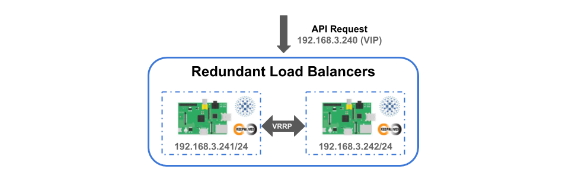

# アクティブ/スタンバイ冗長化構成ロードバランサの構築
## はじめに
[本アーキテクチャー](https://github.com/izewfktvy533zjmn/Build_HA_RasPi_K8s_Cluster/tree/master/READMD.md#アーキテクチャー)において、**アクティブ/スタンバイ冗長化構成ロードバランサ** はアクティブ/アクティブ冗長化構成Kubernetesマスターノード群に対するクラスター操作のAPIリクエストを受け取り、各マスターノードのkube-apiserverにリクエストを振り分ける役割を担っています。  


[本アーキテクチャーのネットワーク構成](https://github.com/izewfktvy533zjmn/Build_HA_RasPi_K8s_Cluster/tree/master/READMD.md#ネットワーク構成)において、アクティブ/スタンバイ冗長化構成ロードバランサのIPアドレスとして仮想IPアドレスである **192.168.3.240/24** を割り当て、ポート番号9000番をリスニングポートとして設定することにしました。  
また、アクティブ/アクティブ冗長化構成Kubernetesマスターノード群のコンポーネントとして稼働する3台のマスターノードに対してはそれぞれ **192.168.3.251/24** と **192.168.3.252/24** 、**192.168.3.253/24** を割り当てることにしました。  


ここでは、ネットワーク構成をもとにアクティブ/スタンバイ冗長化構成ロードバランサの構築と動作検証を行っていきます。  

<br>

まずは、ロードバランサ構築用スクリプトをダウンロードし、スクリプトに実行権限を与えていきます。  
下記のコマンドを実行して下さい。  

```
cd $HOME
git clone https://github.com/izewfktvy533zjmn/Build_HA_RasPi_K8s_Cluster.git
cd Build_HA_RasPi_K8s_Cluster/rlb/scripts && chmod +x *
```


## アクティブ/スタンバイ冗長化構成ロードバランサの構築方法
### Keepalived設定ファイルの作成
次に、**make_keepalived-conf.sh** スクリプトを使用して、Keepalivedを起動するための設定ファイルを作成していきます。  

```
./make_keepalived-conf.sh
Usage: ./make_keepalived-conf.sh VIRTUAL_IP_ADDRESS
```

スクリプトの引数としてアクティブ/スタンバイ冗長化構成ロードバランサで使用する仮想IPアドレスを指定し、スクリプトを **piユーザ権限** 実行します。  

```
./make_keepalived-conf.sh 192.168.3.240
```

設定ファイルが作成されると下記のようなメッセージが現れます。  

```
make keepalived.conf done.
```

Build_HA_RasPi_K8s_Cluster/rlb/config フォルダ直下に、下記の内容の **keepalived.conf** ファイルが作成されていることを確認します。  

```
vrrp_script chk_haproxy {
    script   "systemctl is-active haproxy"
    interval 1
    rise     2
    fall     3
}

vrrp_instance HA-CLUSTER {
    state BACKUP
    nopreempt
    interface eth0
    virtual_router_id 1
    priority 100
    advert_int 1
    virtual_ipaddress {
        192.168.3.240
    }
    track_script {
        chk_haproxy
    }
}
```


### Keepalived設定ファイルの説明
上記の設定ファイルの内容に関して少し説明しておきます。  


#### vrrp_scriptセクション
**vrrp_scriptセクション** にて、HAProxyに対するヘルスチェックの内容を定義しています。  

**scriptパラメータ** に対してヘルスチェックとして実施するコマンドである**"systemctl is-active haproxy"** を指定し、**intervalパラメータ** に対してはヘルスチェックの実施間隔を指定することでヘルスチェックを1秒間隔で実施するようにしています。  

また、ロードバランサに対するヘルスチェックが3回連続で失敗した場合には障害が発生したとみなし、一方で、障害が発生したロードバランサに対するヘルスチェックが2回連続で成功した場合にはロードバランサが復旧したとみなすように **fallパラメータ** と **riseパラメータ** に対する設定を行っています。  


#### vrrp_instanceセクション
**vrrp_instanceセクション** にて、**stateパラメータ** をBACKUP、**priorityパラメータ** を同じ値にすることで、Keepalivedを先に起動させたロードバランサをアクティブ状態、後に起動させたロードバランサをスタンバイ状態として稼働させるようにしています。  

また、**nopreemptパラメータ** を設定することで障害が発生したロードバランサが復旧した際、フェイルバックが行われないようにしています。  

**virtual_ipaddressブロック** では仮想IPアドレスを設定し、**track_scriptブロック** にてvrrp_scriptセクションで定義したヘルスチェックを実行するように設定しています。  

上記の設定により、HAProxyに対するヘルスチェックが失敗したり、Keepalivedに障害が発生した場合にフェイルオーバーを発生させることができるため、スタンバイ状態のロードバランサが仮想IPアドレスを引き継いだ上でアクティブ状態に遷移し、高可用性Kubernetesクラスターのロードバランサとしての機能を継続させることができます。  


### HAProxy設定ファイルの作成
次に、**make_haproxy-cfg.sh** スクリプトを使用して、HAProxyを起動するための設定ファイルを作成していきます。  

```
./make_haproxy-cfg.sh
Usage: ./make_haproxy-cfg.sh HAPROXY_PORT CONTROL_PLANES...
```

スクリプトの引数としてアクティブ/スタンバイ冗長化構成ロードバランサで使用するリスニングポート番号とアクティブ/アクティブ冗長化構成Kubernetesマスターノード群のコンポーネントとして稼働するマスターノードのIPアドレスを指定し、スクリプトを **piユーザ権限** 実行します。  

```
./make_haproxy-cfg.sh 9000 192.168.3.251 192.168.3.252 192.168.3.253
```

設定ファイルが作成されると下記のようなメッセージが現れます。  

```
make haproxy.cfg done.
```

Build_HA_RasPi_K8s_Cluster/rlb/config フォルダ直下に、下記の内容の **haproxy.cfg** ファイルが作成されていることを確認します。  

```
global
    log /dev/log    local0
    log /dev/log    local1 notice
    chroot /var/lib/haproxy
    stats socket /run/haproxy/admin.sock mode 660 level admin expose-fd listeners
    stats timeout 30s
    user haproxy
    group haproxy
    daemon
    ca-base /etc/ssl/certs
    crt-base /etc/ssl/private
    ssl-default-bind-ciphers ECDH+AESGCM:DH+AESGCM:ECDH+AES256:DH+AES256:ECDH+AES128:DH+AES:RSA+AESGCM:RSA+AES:!aNULL:!MD5:!DSS
    ssl-default-bind-options no-sslv3


defaults
    log global
    mode tcp
    option tcp-check
    option tcplog
    option  dontlognull
    retries 6
    timeout connect 3000ms
    timeout client  3000ms
    timeout server  60000ms
    errorfile 400 /etc/haproxy/errors/400.http
    errorfile 403 /etc/haproxy/errors/403.http
    errorfile 408 /etc/haproxy/errors/408.http
    errorfile 500 /etc/haproxy/errors/500.http
    errorfile 502 /etc/haproxy/errors/502.http
    errorfile 503 /etc/haproxy/errors/503.http
    errorfile 504 /etc/haproxy/errors/504.http


frontend kube-apiserver
    bind *:9000
    default_backend kube-apiserver


backend kube-apiserver
    balance roundrobin
    option redispatch
    server master1 192.168.3.251:6443 check inter 3000ms rise 30 fall 3
    server master2 192.168.3.252:6443 check inter 3000ms rise 30 fall 3
    server master3 192.168.3.253:6443 check inter 3000ms rise 30 fall 3
```


### HAProxy設定ファイルの説明
上記の設定ファイルの内容に関して少し説明しておきます。  


#### globalセクション
**globalセクション** では、ログの設定やプロセスの実行に使用するユーザー/グループの設定、PIDファイルのパスの指定などHAProxyのプロセス全体で共有するパラメータを設定することができます。  
なお、これらの設定項目はデフォルト値が記述された設定ファイルの内容そのものです。


#### defaultsセクション
**defaultsセクション** はglobalセクション以外のセクションにおけるパラメータのデフォルト値を指定できるセクションで、複数のセクションで共通するパラメータの設定を行いたい場合に使用します。  
本セクションでは、タイムアウトやリトライ数などのパラメータに対する設定を行うことができます。  

本設定ファイルでは、転送先サーバーへの接続に失敗した際のリトライ試行数を6回とするために、**retriesキーワード** に対して設定を行っています。  

また、**timeout connectキーワード** に対して設定を行うことで、接続時に何も応答がない場合のタイムアウト時間を3秒に設定しています。  

それに加えて、**timeout clientキーワード** に対して設定を行うことで、HAProxyに接続してくるクライアントに対するタイムアウト時間を3秒に、**timeout serverキーワード** に対して設定を行うことで、HAProxyにおける接続転送先サーバーのタイムアウト時間を6秒に設定しています。  


#### HTTPモードとTCPモード
HAProxyでは、**HTTPモード** と **TCPモード** という動作モードが用意されています。  
どちらのモードも、クライアントからの接続を別のサーバーに転送するという動作に変わりありませんが、TCPモードではTCPレベル(L4)でロードバランスするので処理速度の向上が見込めます。  
そのため、本アーキテクチャーにおけるロードバランサでは、**modeキーワード** に対して **"tcp"** を指定し、TCPモードとして動作するようにを設定しています。  


#### フロントエンドとバックエンド
HAProxyでは、**フロントエンド** と **バックエンド** という単位でプロキシとしての動作に関する設定を行うようになっています。  
フロントエンドは待ち受け処理に関する設定を、バックエンドは転送先のサーバーの指定に関する設定を行います。   
HAProxyの設定では、まずフロントエンドにて待ち受けを行う条件の設定とその条件を満たす接続を転送するバックエンドに関する設定を行い、次に、バックエンドにて使用するサーバーを指定することでどの接続をどのサーバーに転送するのかというルールの設定を行う仕組みになっています。　　


#### frontendセクション
**frontendセクション** では、フロントエンドで待ち受けを行う条件とその条件を満たす接続を転送するバックエンドに関する設定を行うことができます。  
本設定ファイルでは、**kube-apiserver** という名前のフロントエンドを定義しています。

このフロントエンドの対して **bindキーワード** を使用して、待ち受けに使用するIPアドレスとポート番号として、そのロードバランサに割り当てられているすべてのIPアドレスに対し、9000番ポートで待ち受けを行うに設定しています。  

_**\* ここで、仮想IPアドレスを待ち受けアドレスに指定してしてしまうと、スタンバイ状態のロードバランサでは仮想IPアドレスが設定されていないためHAProxyの起動に失敗してしまいます。**_  
_**自分で設定ファイルを作成する場合は注意して下さい。**_  

**default_backendキーワード** に対しては、bindキーワードで指定した待ち受け先に対して接続があった場合のデフォルトの転送先バックエンドとして、**"kube-apiserver"** を指定しています。


#### backendセクション
**backendセクション** では、バックエンドで使用するサーバーを指定することで、どの接続をどのサーバーに転送するのかというルールを設定するを行うことができます。    
本設定ファイルでは、**kube-apiserver** という名前のバックエンドを定義しています。  

本セクションにおける **balanceキーワード** では、負荷分散アルゴリズムを指定することができます。  
本設定ファイルでは、balanceキーワードとして **"roundrobin"** を指定しており、ラウンドロビン方式で負荷分散を行うように設定しています。  

**optionキーワード** に **"redispatch"** を設定すると
バックエンドで指定されているサーバーの一部が故障したり、停止した状態の場合にそのサーバーに対する接続が振り分けられるのを防ぐことができる。  

**optionキーワード** に **"redispatch"** を設定すると共に、**retriesキーワード** を設定した場合、
バックエンドで指定されているサーバーの一部が故障したり、停止した状態の際に、retriesキーワードで設定した回数、接続が失敗したときそのサーバーに対する接続の振り分けを止め、別のサーバーにその接続を振り分けることができます。  

しかしこの設定では、retriesキーワードで設定した回数の接続が失敗した場合、別のサーバーにその接続を振り分けを行うため、故障したり、停止したりしているサーバーへの接続の振り分け自体は行われてしまいます。
これに関しては、サーバーの死活監視を行う設定を追加することで、故障や停止しているサーバーに対しては接続が振り分けられないようにすることができます。  

サーバーの死活監視を有効にするには、**serverキーワード** に **checkオプション** を指定します。  
本設定ファイルでは、checkオプションに対して、3秒おきに死活監視が行われるように **interパラメータ** を設定し、死活監視が3回連続で失敗した場合にはサーバが故障したとみなし、一方で、故障したサーバーに対する死活監視が30回連続で成功した場合にはサーバーが復旧したとみなすように **fallパラメータ** と **riseパラメータ** に対する設定を行っています。  

_**\* HAProxyの詳細に関しましては、[多機能なロードバランサとして使える多機能プロクシサーバー「HAProxy」入門](https://knowledge.sakura.ad.jp/8078/) を参照して下さい。**_  
_**HAProxyに関してとてもわかりやすく説明しています。**_


### ロードバランサの構築
最後に、**build.sh** スクリプトを使用して、ロードバランサを構築していきます。  

```
sudo ./build.sh
Usage: ./build.sh HAPROXY_PORT
```

スクリプトの引数としてアクティブ/スタンバイ冗長化構成ロードバランサで使用するリスニングポート番号を指定し、スクリプトを **sudo権限** で実行します。

```
sudo ./build.sh 9000
```

ロードバランサの構築が完了すると下記のようなメッセージが現れます。  

```
build done.
```


**build.sh** スクリプトは、KeepalivedとHAProxyのパッケージをインストールし、
**iptables** コマンドを使用して、アクティブ/スタンバイ冗長化構成ロードバランサで利用するリスニングポートに対する受信パケットの流入を許可するように設定します。  
また、ロードバランサの再起動後にもリスニングポートを開放し続けるために **/etc/rc.local** ファイルに対する編集を行います。  
その後、[Keepalived設定ファイルの作成](https://github.com/izewfktvy533zjmn/Build_HA_RasPi_K8s_Cluster/tree/master/rlb/READMD.md#Keepalived設定ファイルの作成)と
[HAProxy設定ファイルの作成](https://github.com/izewfktvy533zjmn/Build_HA_RasPi_K8s_Cluster/tree/master/rlb/READMD.md#HAProxy設定ファイルの作成)で作成した設定ファイルを　
systemdの環境変数として設定されている各サービスのエントリポイントに設置し、KeepalivedとHAProxyを起動させることでロードバランサの構築を完了させます。  

_**\* bulid.shスクリプトの詳細に関しましては、[こちら](https://github.com/izewfktvy533zjmn/Build_HA_RasPi_K8s_Cluster/tree/master/rlb/scripts/build.sh)を参照して下さい。**_


### アクティブ/スタンバイ冗長化構成ロードバランサの稼働
[同様の手順](https://github.com/izewfktvy533zjmn/Build_HA_RasPi_K8s_Cluster/tree/master/rlb/READMD.md#アクティブ/スタンバイ冗長化構成ロードバランサの構築方法)をもう1台のロードバランサに対しても行うことで、**アクティブ/スタンバイ冗長化構成ロードバランサ** を稼働させることができます。  

もう1台のロードバランサに対しても[同様の手順](https://github.com/izewfktvy533zjmn/Build_HA_RasPi_K8s_Cluster/tree/master/rlb/READMD.md#アクティブ/スタンバイ冗長化構成ロードバランサの構築方法)を行うことで、**アクティブ/スタンバイ冗長化構成ロードバランサ** を稼働させることができます。  

<br>


## アクティブ/スタンバイ冗長化構成ロードバランサの解体方法
アクティブ/スタンバイ冗長化構成ロードバランサの解体させるには、コンポーネントとして稼働するロードバランサに対して **unbulid.sh** を実行します。

```
sudo ./unbulid.sh
Usage: unbulid.sh HAPROXY_PORT
```

スクリプトの引数としてアクティブ/スタンバイ冗長化構成ロードバランサで使用しているリスニングポート番号を指定し、スクリプトを **sudo権限** で実行します。

```
sudo ./unbulid.sh
```

ロードバランサの解体が完了すると下記のようなメッセージが現れます

```
unbuild done.
```

_**\* unbulid.shスクリプトの詳細に関しましては、[こちら](https://github.com/izewfktvy533zjmn/Build_HA_RasPi_K8s_Cluster/tree/master/rlb/scripts/unbuild.sh)を参照して下さい。**_  
_**なお、一度作成したKeepalivedの設定ファイルとHAProxyの設定をそのまま使用して再構築する場合には、もう一度 build.shスクリプトを実行します。**_  
_**新しい設定ファイルを使用して再構築する場合には、[Keepalived設定ファイルの作成](https://github.com/izewfktvy533zjmn/Build_HA_RasPi_K8s_Cluster/tree/master/rlb/READMD.md#Keepalived設定ファイルの作成)と
[HAProxy設定ファイルの作成](https://github.com/izewfktvy533zjmn/Build_HA_RasPi_K8s_Cluster/tree/master/rlb/READMD.md#HAProxy設定ファイルの作成)からやり直す必要があります。**_


## アクティブ/スタンバイ冗長化構成ロードバランサの動作検証
